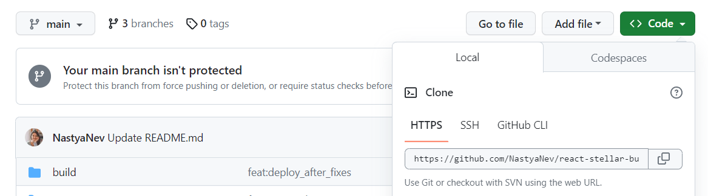
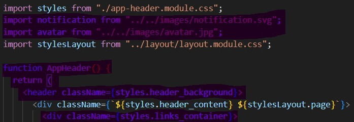
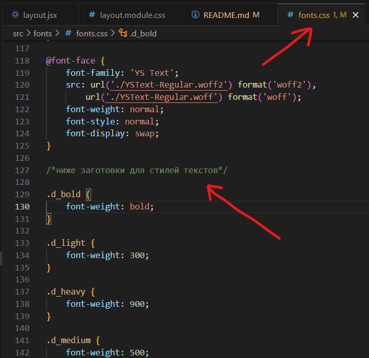

 <p align="center">
  <b align="center" >Demo опубликавано на GitHub-pages - <a href=" https://nastyanev.github.io/career-hackathon-frontend/" title="Ссылка на GitHub Pages">ссылка</a>.</b>
 </p>
<p align="center">
  
</p>

***НАЧАЛО РАБОТЫ:***

Чтобы скачать проект к себе и начать над ним работать:

1. Прислать лиду свой ник на github-е, чтобы тебя добавили в соавторы проекта.
2. Клонировать репозиторий
   ```console
   git clone https://github.com/YOUR-USERNAME/YOUR-REPOSITORY
   ```

   Ссылка на репо в зеленой кнопочке "Code".


5. Установить зависимости из package.json
   ```console
   npm install
   ```

  ВАЖНО!!! Теперь зависимостри всгда устанавливаем с ключем
  ```console
  --legacy-peer-deps
  ```
  НАПРИМЕР при установке зависимострей
  ```console
   npm install --legacy-peer-deps
   ```


6. Запустить проект локально
   ```console
   npm start
   ```
***ПРАВИЛА РАБОТЫ:***

* Работаем в **отдельных ветках**, чтобы не мешать друг другу.
  
* Выполняем только **свою задачу**! Если ты, например, верстаешь кнопки, тебе кажется, что нужно поправить верстку всей страницы, уточни, не работает ли над этим кто-то другой!
  
* Когда работа в твоей ветке готова, замерджи ее в main. Пока что будем мерджить без pull request-ов. Если при мержде возникают конфликты, **не затирай чужой код**!
  
* Прежде чем создать новую ветку, не забудь **запулить** все изменения из main к себе
  ```console
  git pull
  ```
  
* Все **компоненты берем из MUI** и кастомизируем согласно макету от дизайнеров и UI-kit.
  
* Стараемся писать сразу **на TS**!
  
* Лучше **не повторять стили** для разных элементов, а импортить из других компонентов и делать микс классов. Пример :point_down:


В примере в jsx файл компонента импортированы стили самого компонента
```jsx
import styles from "./app-header.module.css";
```
Импортированы нужные стили из другого компонента
```jsx
import stylesLayout from "../layout/layout.module.css";
```
И из нужных классов сделан микс
```html
<div className={`${styles.header_content} ${stylesLayout.page}`}>
```

***ЧТО СДЕЛАНО:***

* Установлены библиотеки:<br />
  &nbsp;&nbsp;&nbsp;&nbsp;1. React<br />
  &nbsp;&nbsp;&nbsp;&nbsp;2. Redux<br />
  &nbsp;&nbsp;&nbsp;&nbsp;3. Toolkit<br />
  &nbsp;&nbsp;&nbsp;&nbsp;4. MUI<br />
  &nbsp;&nbsp;&nbsp;&nbsp;5. react-router-dom

* Установлены шрифты.

  В качестве основного дизайнерами выбран пакет шрифтов YS из кита. В качестве основного для всего приложения установлен шрифт YS Display, но обратите внимание,   что в том наборе есть еще шрифт YS Text. Последний также подключен к проекту, но не в качестве основного.
  
  В файле ```fonts.css``` сделаны заготовки классов для стилей шрифтов, чтобы их также не дублировать и делать микс.

  
  
  Класс выглядит так: ```.d_medium_it```<br />
  &nbsp;&nbsp;&nbsp;&nbsp;Первая буква - это либо шрифт Display ```d_```, либо Text ```t_``` ;<br />
  &nbsp;&nbsp;&nbsp;&nbsp;Второе слово - это толщина шрифта, может быть ```bold``` , ```medium``` , ```thin``` , ```regular``` , ```light``` ;<br />
  &nbsp;&nbsp;&nbsp;&nbsp;Сочетание ```_it``` добавляется, если требуется шрифт Italic;
  
  **По умолчанию установлен шрифт YSDisplay-Regular.**

* Сверстана шапка общая для всех страниц.
* Сделан роутинг на 3 основные страницы.
